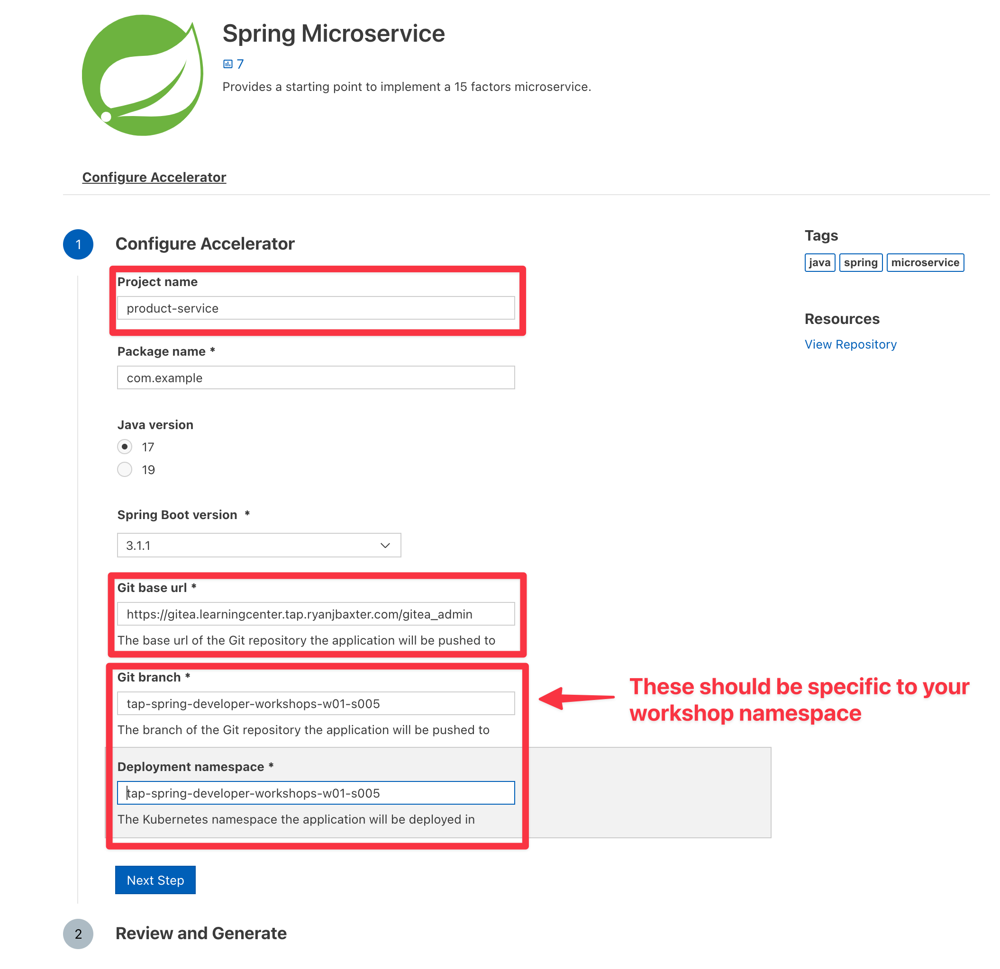

Before we have a closer look at the challenges of our typical microservice application, let's **implement** one of the services from scratch - in this case the **product service**.

The easiest way to get started you're probably familiar with is visiting [start.spring.io](https://start.spring.io), select your Spring Boot version and the dependencies you want to use.

Inspired by the Spring Initializr, **Application Accelerators for VMware Tanzu** enables developers to create new applications based on templates implemented in any technology that follow enterprise standards of your organization. This accelerates how you go from idea to production with ready-made, enterprise-conformant code and configurations without needing to read tons of docs straight away.

By clicking on the below link, you will open the IDE plugin to see a list of Accelerators available.
```editor:execute-command
command: workbench.view.extension.tanzu-app-accelerator
```

Select the **Spring Microservice** accelerator from the list, and change the following values in the form:
- **Name:** `product-service`
- **Git base url:** `{{ ENV_GITEA_BASE_URL}}`
- **Git branch:** `{{ session_namespace }}`
- **Deployment namespace:** `{{ session_namespace }}`



Press **Continue** until you see **Generate Project**. When you click on **Generate Project** (Click **OK** at the pop-up window), a new tab will open. The Accelerator has now generated the code in a new tab. We can close the tab and continue to work on the IDE integrated into the workshop UI.


```editor:execute-command
command: workbench.view.explorer
```
```editor:open-file
file: product-service/src/main/java/com/example/productservice/Application.java
```

The next step is to push the code to a Git repository to collaborate with your team members on it. 
```terminal:execute
command: cd product-service && git init -b {{ session_namespace }} && git remote add origin {{ ENV_GITEA_BASE_URL}}/product-service.git && git add . && git commit -m "Initial implementation" && git push -u origin {{ session_namespace }} && cd ..
clear: true
```

**TODO: Add description to commands**

```editor:append-lines-to-file
file: ~/product-service/src/main/java/com/example/productservice/product/Product.java
text: |2
  package com.example.productservice.product;

  public class Product {

      private Long id;
      private String name;

      private Product(Long id, String name) {
          this.id = id;
          this.name = name;
      }

      public static Product create(Long id, String name) {
          return new Product(id, name);
      }

      public Long getId() {
          return id;
      }

      public void setId(Long id) {
          this.id = id;
      }

      public String getName() {
          return name;
      }

      public void setName(String name) {
          this.name = name;
      }
  }
```

```editor:append-lines-to-file
file: ~/product-service/src/main/java/com/example/productservice/product/ProductApplicationService.java
text: |2
  package com.example.productservice.product;

  import org.slf4j.Logger;
  import org.slf4j.LoggerFactory;
  import org.springframework.beans.factory.annotation.Value;
  import org.springframework.stereotype.Service;

  import java.util.List;
  import java.util.stream.Collectors;

  @Service
  public class ProductApplicationService {

      private static final Logger log = LoggerFactory.getLogger(ProductApplicationService.class);

      @Value("${product-service.product-names}")
      private List<String> productNames;

      List<Product> fetchProducts() {
          log.info("Fetch products called");
          return productNames.stream()
                  .map(name -> Product.create((long) (productNames.indexOf(name) + 1), name))
                  .collect(Collectors.toList());
      }
  }
```

```editor:insert-lines-before-line
file: ~/product-service/src/main/java/com/example/productservice/product/ProductResource.java
line: 5
text: "import java.util.List;"
```

```editor:insert-lines-before-line
file: ~/product-service/src/main/java/com/example/productservice/product/ProductResource.java
line: 11
text: |2
    private final ProductApplicationService productApplicationService;

    ProductResource(ProductApplicationService productApplicationService) {
        this.productApplicationService = productApplicationService;
    }
```

```editor:select-matching-text
file: ~/product-service/src/main/java/com/example/productservice/product/ProductResource.java
text: "Hello World"
before: 1
```
```editor:replace-text-selection
file: ~/product-service/src/main/java/com/example/productservice/product/ProductResource.java
text: |2
    public ResponseEntity<List<Product>> fetchProducts() {
        return ResponseEntity.ok(productApplicationService.fetchProducts());
```

**TODO: Use VSCode Tanzu Plugin for iterate and debug, to identify and fix missing application.yaml config**

```editor:append-lines-to-file
file: ~/product-service/src/main/resources/application.yaml
text: "product-service.product-names: VMware Tanzu Application Platform"
```
```editor:append-lines-to-file
file: ~/product-service/src/test/resources/application.yaml
text: "product-service.product-names: VMware Tanzu Application Platform"
```

Let's commit the updated source code.
```terminal:execute
command: |
  cd product-service && git add . && git commit -m "Add business code" && git push
  cd ..
clear: true
```

After the basic implementation of our product service, we will now configure a continuous path to production.
