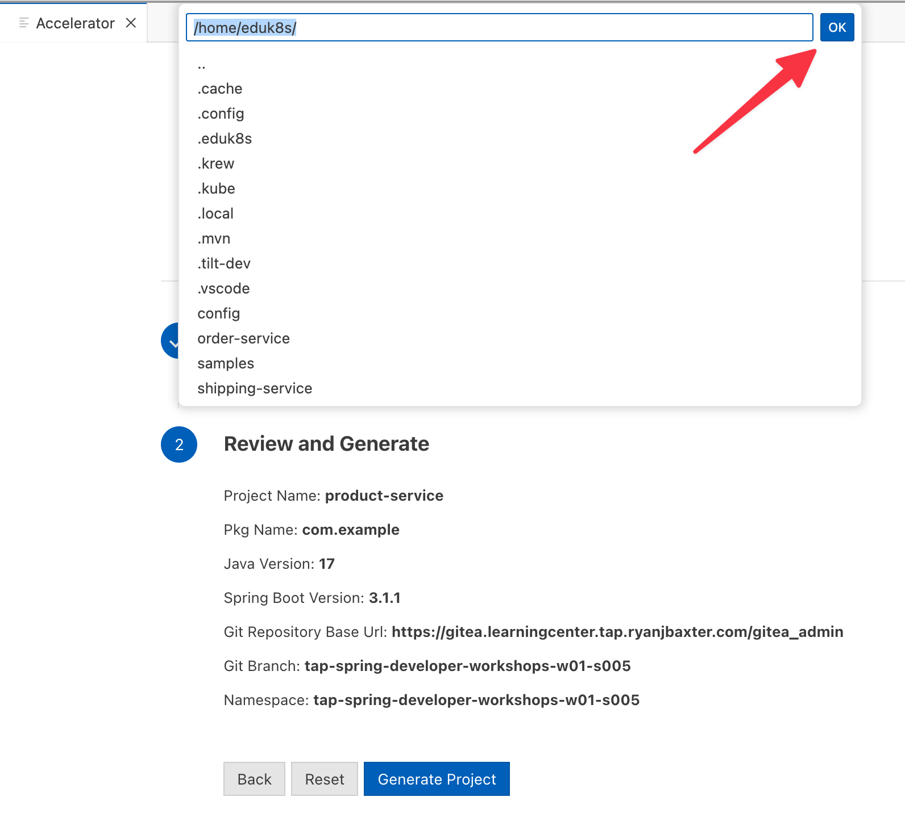

Before we have a closer look at the challenges of our typical microservice application, let's **implement** one of the services from scratch - in this case the **product service**.

The easiest way to get started you're probably familiar with is visiting [start.spring.io](https://start.spring.io), select your Spring Boot version and the dependencies you want to use.

Inspired by the Spring Initializr, **Application Accelerators for VMware Tanzu** enables developers to create new applications based on templates implemented in any technology that follow enterprise standards of your organization. This accelerates how you go from idea to production with ready-made, enterprise-conformant code and configurations without needing to read tons of docs straight away.

By clicking on the below link, you will open the IDE plugin to see a list of Accelerators available.
```editor:execute-command
command: workbench.view.extension.tanzu-app-accelerator
```

Select the **Spring Microservice** accelerator from the list, and change the following values in the form:
- **Name:** `product-service`
- **Git base url:** `{{ ENV_GITEA_BASE_URL}}`
- **Git branch:** `{{ session_namespace }}`
- **Deployment namespace:** `{{ session_namespace }}`


- Press **Next Step**
- Press **Generate Project**. When you click on **Generate Project** there will be a popup window that opens at the top of the Editor with the path `/home/eduk8s/`, click **OK** to accept the defaults.



- The Accelerator has now generated the code.  You may see a pop up in the bottom right hand corner of the IDE asking if you want to open the project in a new tab.  If you do you can close that pop up and continue on to the next step.  If you clicked OK to the pop up and a new tab opened, you may close the new tab.  

Next lets add the code generated by the accelerator to a Git repo.  The following command will initialize the git repo locally, add a remote repo, and commit and push the code to the remote repository.

```terminal:execute
command: cd product-service && git init -b {{ session_namespace }} && git remote add origin {{ ENV_GITEA_BASE_URL}}/product-service.git && git add . && git commit -m "Initial implementation" && git push -u origin {{ session_namespace }} && cd ..
clear: true
```

With the code commited to a git repo lets start building out the product service.

Before we add any code though, lets first look at what the accelerator created for us.

First head back to the IDE by clicking the command below.

```editor:execute-command
command: workbench.view.explorer
```

Lets first look at the `pom.xml` file.

```editor:open-file
file: product-service/pom.xml
```

You will see we are using Java 17, Spring Boot 3.1.1, Spring Cloud 2023.0.3, and also including the dependencies `spring-boot-starter-web`, `spring-boot-starter-actuator`, and `spring-boot-starter-security`.

The accelerator also generated a main `Application` class for us which we can use to run our application.

```editor:open-file
file: product-service/src/main/java/com/example/productservice/Application.java
```

It also generated another class called `ProductResource`.


```editor:open-file
file: product-service/src/main/java/com/example/productservice/product/ProductResource.java
```

`ProductResource` is a `RestController` with a single endpoint at `/api/v1/products` which returns `Hello World`.

We want to change this endpoint to return a list of products so first lets create a way of representing a product in our application.

Click the command below to create a `Product` class.

```editor:append-lines-to-file
file: ~/product-service/src/main/java/com/example/productservice/product/Product.java
text: |2
  package com.example.productservice.product;

  public class Product {

      private Long id;
      private String name;

      private Product(Long id, String name) {
          this.id = id;
          this.name = name;
      }

      public static Product create(Long id, String name) {
          return new Product(id, name);
      }

      public Long getId() {
          return id;
      }

      public void setId(Long id) {
          this.id = id;
      }

      public String getName() {
          return name;
      }

      public void setName(String name) {
          this.name = name;
      }
  }
```

Now lets add a `Service` that we can use to fetch a list of products.  

Click the command below to add the `ProductApplicationService` class.

```editor:append-lines-to-file
file: ~/product-service/src/main/java/com/example/productservice/product/ProductApplicationService.java
text: |2
  package com.example.productservice.product;

  import org.slf4j.Logger;
  import org.slf4j.LoggerFactory;
  import org.springframework.beans.factory.annotation.Value;
  import org.springframework.stereotype.Service;

  import java.util.List;
  import java.util.stream.Collectors;

  @Service
  public class ProductApplicationService {

      private static final Logger log = LoggerFactory.getLogger(ProductApplicationService.class);

      @Value("${product-service.product-names}")
      private List<String> productNames;

      List<Product> fetchProducts() {
          log.info("Fetch products called");
          return productNames.stream()
                  .map(name -> Product.create((long) (productNames.indexOf(name) + 1), name))
                  .collect(Collectors.toList());
      }
  }
```

The `ProductApplicationService.fetchProducts` method returns a list of `Product`s created from the configuration property `product-service.product-names`.

Now lets modify `ProductResource` so it uses `ProductApplicationService` to fetch the list of products and return them when a
`GET` request is made to `/api/v1/products`.

```editor:insert-lines-before-line
file: ~/product-service/src/main/java/com/example/productservice/product/ProductResource.java
line: 5
text: "import java.util.List;"
```

```editor:insert-lines-before-line
file: ~/product-service/src/main/java/com/example/productservice/product/ProductResource.java
line: 11
text: |2
    private final ProductApplicationService productApplicationService;

    ProductResource(ProductApplicationService productApplicationService) {
        this.productApplicationService = productApplicationService;
    }
```

```editor:select-matching-text
file: ~/product-service/src/main/java/com/example/productservice/product/ProductResource.java
text: "Hello World"
before: 1
```
```editor:replace-text-selection
file: ~/product-service/src/main/java/com/example/productservice/product/ProductResource.java
text: |2
    public ResponseEntity<List<Product>> fetchProducts() {
        return ResponseEntity.ok(productApplicationService.fetchProducts());
```

**TODO: Use VSCode Tanzu Plugin for iterate and debug, to identify and fix missing application.yaml config**

```editor:append-lines-to-file
file: ~/product-service/src/main/resources/application.yaml
text: "product-service.product-names: VMware Tanzu Application Platform"
```
```editor:append-lines-to-file
file: ~/product-service/src/test/resources/application.yaml
text: "product-service.product-names: VMware Tanzu Application Platform"
```

Let's commit the updated source code.
```terminal:execute
command: |
  cd product-service && git add . && git commit -m "Add business code" && git push
  cd ..
clear: true
```

After the basic implementation of our product service, we will now configure a continuous path to production.
